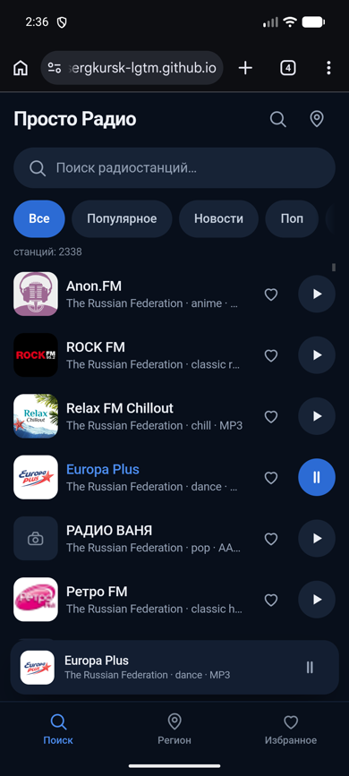

# Просто Радио

**Веб-приложение для прослушивания российского интернет-радио.** Каталог на 2338 станций встроен в приложение и работает без интернета — через сеть идут только звук и логотипы.

### ▶ [Открыть приложение](https://sergkursk-lgtm.github.io/prosto-radio-web/)



---

## Что умеет

- **Работает без сети.** Список, поиск, жанры и регионы читаются из встроенного файла. Приложение открывается в самолётном режиме.
- **Поиск по названию и жанру** — кириллица и латиница, регистр не важен.
- **Регионы России** — определяется по часовому поясу, меняется вручную.
- **Избранное** сохраняется на устройстве.
- **Продолжает с последней станции.** Эфир возобновляется с той станции, на которой вы закрыли приложение.
- **Играет в фоне.** Управление с экрана блокировки и с кнопок наушников через Media Session.
- **Устанавливается на телефон** как обычное приложение — на iPhone через «Добавить на экран Домой».

## Быстрый старт

```bash
git clone https://github.com/sergkursk-lgtm/prosto-radio-web
cd prosto-radio-web
python3 -m http.server 8099
```

Открыть `http://localhost:8099`. Сборка не нужна — это статические файлы.

## Установка на iPhone

1. Открыть [ссылку](https://sergkursk-lgtm.github.io/prosto-radio-web/) **в Safari** (не в Chrome).
2. «Поделиться» → **«На экран Домой»**.
3. Запускать **с иконки**, а не из вкладки — так звук не прерывается при сворачивании.

Автовоспроизведения при запуске не будет: Safari даёт звук только после касания. Приложение откроется с выбранной станцией и надписью «Нажмите ▶».

## Как устроено

```
index.html              разметка
styles.css              оформление
app.js                  вся логика: каталог, поиск, избранное, плеер
stations.json           каталог станций, 950 КБ
sw.js                   сервис-воркер: офлайн-кэш
manifest.webmanifest    описание для установки
worker/stream-proxy.js  прокси потоков для Cloudflare
wrangler.toml           конфигурация воркера
```

**Каталог встроен намеренно.** Открытый Radio-Browser без VPN недоступен из России, поэтому список скачивается один раз при сборке и лежит рядом файлом.

**Прокси нужен из-за смешанного содержимого.** Больше половины станций вещают по `http`, а браузер блокирует такое аудио на `https`-странице. Cloudflare Worker принимает `http`-поток и отдаёт его клиенту по `https`. Живой адрес — в `app.js`, переменная `PROXY_BASE`.

## Ограничения

- **Каталог застывший.** Чтобы обновить список, замените `stations.json` и поднимите версию в `sw.js` — иначе браузер отдаст старый файл из кэша.
- **Логотипы есть не у всех станций** — часть вещателей не отдаёт иконку ни по одному адресу, тогда показывается заглушка.
- **Названия регионов в каталоге разнородны**: «Moscow», «Москва» и «Moskow» — три записи об одном городе.

## Лицензия

Код — MIT. Каталог станций — данные [Radio-Browser](https://www.radio-browser.info/), права принадлежат вещателям.
